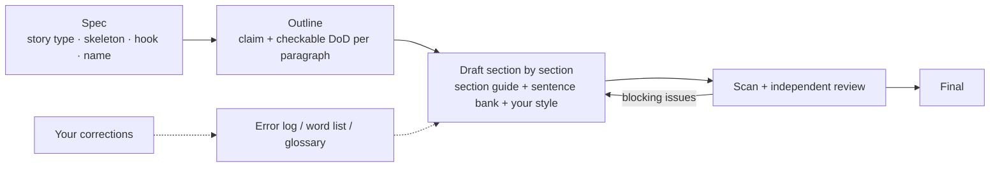

<p align="center">
  
</p>

<p align="center">
  <a href="./LICENSE"></a>
  
  
  
  
  
  
  <a href="https://github.com/xiongqi123123/PaperDNA/pulls"></a>
  <a href="https://github.com/xiongqi123123/PaperDNA/stargazers"></a>
</p>

<p align="center">
  <b>Writing top-venue papers in your own voice, distilled from 1040 CVPR / ICCV papers.</b>
</p>

<p align="center">
  <b>English</b> | <a href="./README_zh-CN.md">简体中文</a>
</p>

---

**PaperDNA** is a plugin for [Claude Code](https://docs.anthropic.com/en/docs/claude-code) and [Codex](https://developers.openai.com/codex) for writing and revising academic papers, tuned for computer vision, autonomous driving and embodied AI. Its writing guidance does not come from rules of thumb: we close-read **1040 award, oral and highlight papers from CVPR 2026 and ICCV 2025**, one by one, and distilled how they tell their story, structure every section, phrase their sentences, choose their words and name their methods. Every default it follows can be traced back to corpus statistics or to specific papers. It also learns your personal style and remembers every correction you make, so it sounds more like you the longer you use it.

> **Language note.** The guidance files are written in Chinese; sentence templates and examples are in English. PaperDNA helps you write English papers, and you can talk to it in Chinese or English.

## Contents

- [Highlights](#highlights)
- [What 1040 Top-Venue Papers Taught Us](#what-1040-top-venue-papers-taught-us)
- [What You Can Ask](#what-you-can-ask)
- [Quick Start](#quick-start)
- [How It Works](#how-it-works)
- [Project Structure](#project-structure)
- [Customization](#customization)
- [Extending the Corpus](#extending-the-corpus)
- [Roadmap](#roadmap)
- [Contributing](#contributing)
- [Acknowledgements](#acknowledgements)
- [License](#license)

## Highlights

- **Corpus-grounded guidance.** Every default comes with evidence: a statistic from the corpus or the papers that do it, never "be clear and fluent".
- **Story first.** Before writing, PaperDNA picks one of 8 story types through a decision flow, then drafts the narrative skeleton and the hook. The abstract, introduction, method and experiments all follow that skeleton.
- **Your voice.** It extracts a style profile from your past papers and logs every correction you make, so the same mistake never comes back.
- **Reviewer's eye.** Each finished section goes to an independent reviewer subagent that never saw the drafting process, which keeps the review honest.
- **Confident, not defensive.** A paper is a press conference, not a self-audit: no self-undermining words, unfavorable results are handled by narrowing claims rather than conceding, and limitations are capped at two, written as scope plus next step. Numbers and tables always stay accurate.
- **Less AI tone.** A scanner flags AI-sounding and empty words line by line. Words that top papers also use, such as *leverage* and *crucial*, are capped rather than banned.

## What 1040 Top-Venue Papers Taught Us

| Finding | Value |
|---|---|
| The most common story is the *bottleneck breakthrough*: pin down the concrete bottleneck of mainstream methods and its root cause, then fix it | 56.0% |
| Autonomous driving papers define a *new problem* more often | 18.8% (CV: 10.5%) |
| Abstract length | median 8 sentences; half fall in 7–9 |
| Split each abstract into five equal parts: the first is mostly background, the second already turns to the method | background 57%; method 44% |
| The abstract's last sentence is a code or project link | 43.1% |
| Introduction length | median 6 paragraphs; half fall in 5–6 |
| A teaser figure (Figure 1) on the first page | 91.3% |
| Contributions listed as bullets | 74.4% |
| Abstracts that use *leverage* | 24.1% |

Full statistics: [`skills/paperdna/references/corpus_stats.md`](skills/paperdna/references/corpus_stats.md).

## What You Can Ask

| You say | PaperDNA does |
|---|---|
| "How should I tell the story of this paper?" | Picks a story type through the decision flow, drafts the narrative skeleton and the hook, and saves them to the paper's spec |
| "Write the introduction" | Chooses a paragraph sequence for the story type, writes paragraph by paragraph with the sentence bank, then scans and sends it to independent review |
| "Revise the abstract" | Checks each sentence's role and structure against the abstract guide and lists every change |
| "Name my method" | Proposes 3–5 title and method-name candidates, checks each against the naming checklist, and searches for name collisions |
| "Review Section 3" | An independent subagent reports blocking issues, suggestions, definition-of-done checks and readability problems |
| "Turn these PDFs into evidence" | Reads the PDFs and writes reference notes with quotable sentences and page numbers; BibTeX only contains verified fields |
| "Close-read this paper" | Breaks down the abstract and introduction sentence by sentence and extracts reusable patterns, wording and style |
| "My LaTeX won't compile" | Reads the log, locates the first error, fixes it and recompiles, for up to 3 rounds |
| "Make this more convincing" / "Cut it down" | Applies the press-release principle: reorganizes around the strongest advantage, narrows over-reaching claims, removes self-undermining wording, and runs the "don't hand the reviewer a knife" checklist |
| "Never use this word again" | Records it in your error log or the AI-tone word list, then rewrites the sentence |

## Quick Start

### Requirements

- [Claude Code](https://docs.anthropic.com/en/docs/claude-code) or [Codex](https://developers.openai.com/codex)
- Python 3.8+ (standard library only for the scanner)
- Optional: `pip install pymupdf` to extract text from PDFs, and `brew install poppler` so Claude can view PDF pages

### Installation

#### Claude Code

In a Claude Code session:

```
/plugin marketplace add xiongqi123123/PaperDNA
/plugin install paperdna@paperdna
```

Or from your shell:

```bash
claude plugin marketplace add xiongqi123123/PaperDNA
claude plugin install paperdna@paperdna
```

Your style profile, error log and personal word list live in the plugin's data directory (`~/.claude/plugins/data/…`), so they survive plugin updates. To update, run `/plugin update paperdna@paperdna`, or enable auto-update for the `paperdna` marketplace in `/plugin`.

<details>
<summary>For contributors: install from a local clone</summary>

```bash
git clone https://github.com/xiongqi123123/PaperDNA.git
claude plugin marketplace add ./PaperDNA
claude plugin install paperdna@paperdna
```

A plugin installed from a local marketplace loads in place, so your edits take effect at the next session (or after `/reload-plugins`). Run `claude plugin validate ./PaperDNA` before pushing, and bump `version` in `.claude-plugin/plugin.json` for every release: users only receive an update when the version changes.
</details>

#### Codex

```bash
codex plugin marketplace add xiongqi123123/PaperDNA
codex plugin add paperdna@paperdna
```

Start a new thread afterwards. The same install also covers the Codex desktop app (restart it after installing). In Codex, your profile lives in `~/.paperdna/profile/`. To update, run `codex plugin marketplace upgrade`; to uninstall, `codex plugin remove paperdna`.

### First run

1. **Extract your style.** Share 3–5 papers you wrote and say: *"Use paperdna to analyze these and update my style profile."*
2. **Start writing.** In your paper repository, say: *"Write the introduction."* On first use, PaperDNA creates a `.paperdna/` folder there for the spec, outline and reference notes; we recommend committing it with your paper.

Type `/paperdna:paperdna` in Claude Code, or mention PaperDNA in Codex, to invoke it directly. It also triggers automatically when you work on a paper.

## How It Works



The guidance itself was built by a corpus pipeline: fetch conference data, select papers, download PDFs, extract text, close-read every paper into a structured note, then synthesize the notes into guides. Both close reading and synthesis run as multi-agent workflows.

## Project Structure

| Kind | Location | Contents |
|---|---|---|
| Writing guidance | `skills/paperdna/` (`references/`, `templates/`, `scripts/`) | Shipped with the skill and shared by everyone |
| Personal profile | Claude Code: the plugin's data directory (`~/.claude/plugins/data/…/profile/`); Codex: `~/.paperdna/profile/` | Style profile, error log, cross-paper glossary, personal word list; kept across plugin updates, never committed |
| Per-paper state | `.paperdna/` in your paper repo | Spec, outline, reference notes |

```
.claude-plugin/                Claude Code: plugin.json and marketplace.json
.codex-plugin/plugin.json      Codex plugin manifest
.agents/plugins/marketplace.json  Codex marketplace
skills/paperdna/               The skill itself, shared by Claude Code and Codex
  SKILL.md                     Entry point: required reading, task routing, hard rules
  references/
    story_types.md             8 story types: decision flow, skeletons, step-by-step writing, exemplar papers
    sections/                  Six section guides: abstract / introduction / related_work / method / experiments / conclusion
    sentence_bank.md           English templates and original sentences for 13 writing functions
    word_style.md              Principles, word choice, claim strength, de-AI rules, style defaults, final checklist
    naming.md                  Titles, method-name construction, first mention, naming process
    anti_defensive.md          Press-release principle: unfavorable results, limitations (max 2), self-audit checklist
    corpus_stats.md            Corpus statistics
    ai_words.json              AI-tone and empty-word list (also read by the scanner)
    workflow.md / review.md    Writing workflow and review criteria
    close_reading.md / literature.md / latex.md / proofread.md / ...
  templates/                   Templates for spec, outline, reference notes, close-reading notes, profile
  scripts/                     ai_style_scan.py (AI-tone scanner), parse_pdf.py (PDF to text)
tools/corpus/                  Corpus pipeline (for maintenance; not needed at runtime)
asset/                         Logo and icon
```

Scripts:

```bash
python3 skills/paperdna/scripts/ai_style_scan.py path/to/paper                   # scan .tex/.md/.txt; --level avoid shows must-fix items only
python3 skills/paperdna/scripts/parse_pdf.py paper.pdf --main-only -o paper.txt  # PDF to text, cut before the references
```

The scanner exits with code 1 when it finds hits, so it fits into pre-commit hooks or CI.

## Customization

**Each rule lives in exactly one file.** To change a rule, edit the file below:

| What to change | File |
|---|---|
| Ban or cap a word | `skills/paperdna/references/ai_words.json` |
| Principles, word choice, claim strength, de-AI rules | `skills/paperdna/references/word_style.md` |
| Story types and skeletons | `skills/paperdna/references/story_types.md` |
| How a section is written | `skills/paperdna/references/sections/<section>.md` |
| Reusable sentence patterns | `skills/paperdna/references/sentence_bank.md` |
| Titles and method names | `skills/paperdna/references/naming.md` |
| Unfavorable results, limitations, defensive wording | `skills/paperdna/references/anti_defensive.md` |
| What the review checks | `skills/paperdna/references/review.md` |
| Your own tone and habits | `profile/style_profile.md` |
| Individual corrections | `profile/error_log.md` (merge recurring ones into your style profile) |

## Extending the Corpus

`tools/corpus/` contains the full pipeline that produced the guidance: fetching conference data, selecting papers, downloading PDFs, extracting text, close-reading each paper and synthesizing the notes. To add a venue or a new year, see [`tools/corpus/README.md`](tools/corpus/README.md).

## Roadmap

- [x] Close-read CVPR 2026 and ICCV 2025 (1040 award, oral and highlight papers) and distill the guides
- [ ] Close-read the already collected ECCV 2026, NeurIPS 2025, ICML 2026 and ICLR 2026 papers
- [ ] English version of the guidance files

## Contributing

Issues and pull requests are welcome. When you change a guide, keep each rule in a single file (see [Customization](#customization)), and back new claims with corpus statistics or the papers that support them.

## Acknowledgements

PaperDNA started as a fork of [AI-Vibe-Writing-Skills](https://github.com/donghuixin/AI-Vibe-Writing-Skills) (MIT), which contributed the ideas of a style profile, an error log and spec-driven writing. The press-release principle against defensive writing is adapted from [anti-defensive-writing-Skill](https://github.com/Adkid-Zephyr/anti-defensive-writing-Skill) (MIT). License notices for both are in [THIRD_PARTY_NOTICES.md](./THIRD_PARTY_NOTICES.md). PaperDNA rebuilt the original fork as a Claude Code skill with corpus-driven guidance, a new workflow, review process and scripts. Thanks to the authors of all the papers in the corpus, whose writing is what this project learns from.

## License

[MIT](./LICENSE). The upstream copyright notice is retained.
