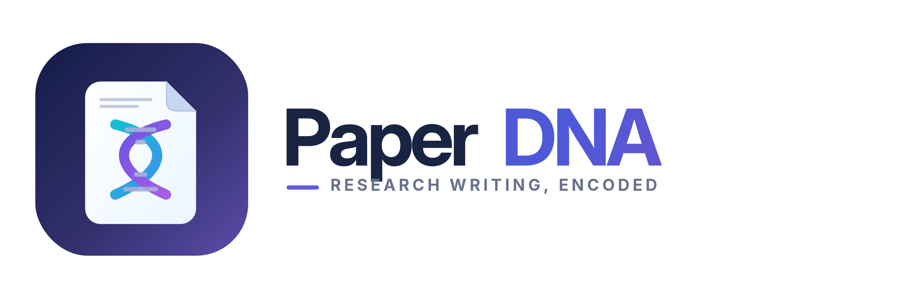
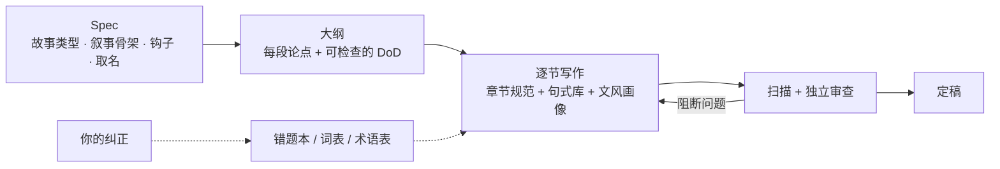

<p align="center">
  
</p>

<p align="center">
  <a href="./LICENSE"></a>
  
  
  
  
  
  
  <a href="https://github.com/xiongqi123123/PaperDNA/pulls"></a>
  <a href="https://github.com/xiongqi123123/PaperDNA/stargazers"></a>
</p>

<p align="center">
  <b>顶会论文的写作基因，加上你自己的文风基因。</b>
</p>

<p align="center">
  <a href="./README.md">English</a> | <b>简体中文</b>
</p>

---

**PaperDNA** 是一个 [Claude Code](https://docs.anthropic.com/en/docs/claude-code) 与 [Codex](https://developers.openai.com/codex) 插件，用来写和改学术论文，面向 CV、自动驾驶和具身智能方向。它的写作规范不是凭经验写的：我们逐篇精读了 **1040 篇 CVPR 2026 / ICCV 2025 的获奖、oral 和 highlight 论文**，提炼出它们怎么讲故事、每一章怎么组织、句子怎么写、词怎么选、方法怎么取名。它遵循的每条默认做法，都能追溯到语料统计或具体论文。同时，它会学习你的文风，记住你每次的纠正，用得越久越像你写的。

> **语言说明**：规范文件用中文写成，句式模板和例句是英文。PaperDNA 帮你写英文论文，你可以用中文或英文和它交流。

## 目录

- [特性](#特性)
- [从 1040 篇顶会论文里学到的几件事](#从-1040-篇顶会论文里学到的几件事)
- [能做什么](#能做什么)
- [快速开始](#快速开始)
- [工作原理](#工作原理)
- [项目结构](#项目结构)
- [自定义](#自定义)
- [扩充语料](#扩充语料)
- [路线图](#路线图)
- [参与贡献](#参与贡献)
- [致谢](#致谢)
- [许可证](#许可证)

## 特性

- **规范来自语料**：每条默认做法都附有依据，要么是语料统计，要么是具体论文，不写"逻辑清晰、表达流畅"这类空话。
- **故事先行**：动笔前按判断流程从 8 种叙事类型里选好讲法，写出叙事骨架和钩子；摘要、引言、方法、实验都按这个骨架展开。
- **你的文风**：从你过去的论文里提取文风画像；每次纠正都记进错题本，同样的错误不会再犯。
- **审稿人视角**：每写完一节，交给一个没看过写作过程的独立子代理审查，避免自己审自己时放水。
- **不写防御性论文**：论文是一场发布会，不是自我审查报告。不用自我削弱词，不利结果靠收缩主张来处理而不是认输，局限最多写 2 条，写成"适用边界 + 后续方向"；数字和表格始终照实。
- **去 AI 味**：扫描脚本逐行标出 AI 味和空洞用词；leverage、crucial 这类顶会论文也常用的词设为限量词，而不是一律禁用。

## 从 1040 篇顶会论文里学到的几件事

| 发现 | 数字 |
|---|---|
| 最常见的故事是"瓶颈突破型"：指出主流方法的具体瓶颈和根因，再对症下药 | 56.0% |
| 自动驾驶论文更常"定义新问题" | 18.8%（CV 为 10.5%） |
| 摘要的长度 | 中位数 8 句，一半在 7–9 句 |
| 把摘要等分为 5 段：第 1 段以背景为主，第 2 段就进入方法 | 背景 57%；方法 44% |
| 摘要最后一句是代码或项目链接 | 43.1% |
| 引言的长度 | 中位数 6 段，一半在 5–6 段 |
| 第一页有 Figure 1 | 91.3% |
| 贡献列表用 bullet | 74.4% |
| 摘要里出现 leverage | 24.1% |

完整统计见 [`skills/paperdna/references/corpus_stats.md`](skills/paperdna/references/corpus_stats.md)。

## 能做什么

| 你说 | PaperDNA 做什么 |
|---|---|
| "这篇论文该怎么讲？" | 按判断流程选故事类型，写出叙事骨架和钩子，存进论文的 spec |
| "帮我写 introduction" | 按故事类型选段落序列，逐段写，从句式库挑句式；写完跑扫描、交独立审查 |
| "摘要改一下" | 对照摘要规范逐句检查作用和句式，列出改动 |
| "给方法起个名字" | 按取名流程给出 3–5 个标题和方法名候选，逐项检查并查重 |
| "审一下第 3 节" | 独立子代理审查：阻断问题、建议改进、DoD 核对、阅读体验 |
| "把这几篇 PDF 整理成证据" | 读 PDF，写文献笔记（可引用原句带页码），BibTeX 只填确认过的字段 |
| "这里加上引用" | 第一次用时问你这篇论文的引用怎么处理。A：自动在 Semantic Scholar / arXiv / Crossref 检索并加 BibTeX，再由独立子代理逐条核查虚假和幻觉引用；B：正文先放 `\cite{TODO:...}` 占位，告诉你该引哪篇，你把 BibTeX 贴回来 |
| "精读这篇范文" | 按模板逐句拆解摘要和引言，提炼句式、用词和写法 |
| "LaTeX 编译报错了" | 读日志、定位第一个错误、修复、重新编译，最多 3 轮 |
| "让这段更有说服力" / "帮我压缩篇幅" | 按发布会原则处理：围绕最强的优势重组，收缩越过证据的主张，删掉自我削弱的措辞，再跑一遍"不给审稿人递刀子"自查 |
| "以后别用这个词" | 写进错题本或 AI 味词表，并改写刚才的句子 |

## 快速开始

### 环境

- [Claude Code](https://docs.anthropic.com/en/docs/claude-code) 或 [Codex](https://developers.openai.com/codex)
- Python 3.8+（扫描脚本只依赖标准库）
- 可选：`pip install pymupdf`（PDF 转文本）；`brew install poppler`（让 Claude 查看 PDF 页面）

### 安装

#### Claude Code

在 Claude Code 会话中输入：

```
/plugin marketplace add xiongqi123123/PaperDNA
/plugin install paperdna@paperdna
```

也可以在终端里执行：

```bash
claude plugin marketplace add xiongqi123123/PaperDNA
claude plugin install paperdna@paperdna
```

文风画像、错题本和个人补充词表保存在插件的数据目录（`~/.claude/plugins/data/…`），插件更新时不会丢失。更新插件用 `/plugin update paperdna@paperdna`，也可以在 `/plugin` 里为 `paperdna` 市场打开自动更新。

<details>
<summary>参与开发：从本地仓库安装</summary>

```bash
git clone https://github.com/xiongqi123123/PaperDNA.git
claude plugin marketplace add ./PaperDNA
claude plugin install paperdna@paperdna
```

从本地目录添加的市场，插件直接从仓库目录加载，修改后下次会话（或执行 `/reload-plugins`）即生效。推送前运行 `claude plugin validate ./PaperDNA`；每次发布都要提高 `.claude-plugin/plugin.json` 里的 `version`，用户只有在版本号变化时才会收到更新。
</details>

#### Codex

```bash
codex plugin marketplace add xiongqi123123/PaperDNA
codex plugin add paperdna@paperdna
```

安装后新开一个会话即可使用。同一次安装也适用于 Codex 桌面版（安装后重启应用）。在 Codex 中，个人画像保存在 `~/.paperdna/profile/`。更新用 `codex plugin marketplace upgrade`，卸载用 `codex plugin remove paperdna`。

### 第一次使用

1. **提取文风**：给出 3–5 篇你自己写的论文，说"用 paperdna 分析这几篇，更新我的文风画像"。
2. **开始写作**：在论文仓库里说"帮我写 introduction"。第一次使用时会在论文仓库创建 `.paperdna/`，里面放 spec、大纲和文献笔记，建议和论文一起纳入 git。

在 Claude Code 中输入 `/paperdna:paperdna`，或在 Codex 中提到 PaperDNA，可以直接调用；写论文、改论文时它也会自动触发。

## 工作原理



写作规范本身由一条语料流水线生成：抓取会议数据、选论文、下载 PDF、转文本，逐篇精读并写成结构化笔记，最后把笔记汇总提炼成规范。精读和汇总都以多 agent 工作流运行。

## 项目结构

| 类别 | 位置 | 内容 |
|---|---|---|
| 写作规范 | `skills/paperdna/`（`references/`、`templates/`、`scripts/`） | 随 skill 发布，所有人共用 |
| 个人画像 | Claude Code：插件的数据目录（`~/.claude/plugins/data/…/profile/`）；Codex：`~/.paperdna/profile/` | 文风画像、错题本、跨论文术语表、个人补充词表；插件更新时保留，不进 git |
| 单篇论文状态 | 论文仓库的 `.paperdna/` | spec、大纲、文献笔记 |

```
.claude-plugin/                Claude Code：plugin.json 与 marketplace.json
.codex-plugin/plugin.json      Codex 插件清单
.agents/plugins/marketplace.json  Codex 插件市场
skills/paperdna/               skill 本体，Claude Code 与 Codex 共用
  SKILL.md                     入口：必读文件、任务路由、硬规则
  references/
    story_types.md             8 种叙事类型：判断流程、骨架、逐步写法、代表论文
    sections/                  六个章节：abstract / introduction / related_work / method / experiments / conclusion
    sentence_bank.md           句式库：13 类写作功能的英文模板与原句
    word_style.md              写作原则、用词、结论强度、去 AI 味、风格参数、定稿检查清单
    naming.md                  取名：标题结构、方法名构造、首次引入、取名流程
    anti_defensive.md          发布会原则：不利结果的处理顺序、局限（最多 2 条）、交稿前自查
    corpus_stats.md            语料统计
    ai_words.json              AI 味与空洞用词表（扫描脚本也读它）
    workflow.md / review.md    写作流程、审查标准
    close_reading.md / literature.md / latex.md / proofread.md / ...
  templates/                   spec、大纲、文献笔记、精读笔记、个人画像的模板
  scripts/                     ai_style_scan.py（去 AI 味扫描）、parse_pdf.py（PDF 转文本）
tools/corpus/                  语料流水线（维护用，skill 运行时不需要）
asset/                         Logo 与图标
```

脚本：

```bash
python3 skills/paperdna/scripts/ai_style_scan.py path/to/paper                   # 扫描 .tex/.md/.txt；--level avoid 只看必须改的项
python3 skills/paperdna/scripts/parse_pdf.py paper.pdf --main-only -o paper.txt  # PDF 转文本，截到参考文献之前
```

扫描有命中时退出码为 1，可以接到 pre-commit 或 CI 中使用。

## 自定义

**每条规则只写在一个文件里。** 想改某类规则时，按下表找到对应文件：

| 想改的内容 | 文件 |
|---|---|
| 禁用或限量某个词 | `skills/paperdna/references/ai_words.json` |
| 写作原则、用词、结论强度、去 AI 味 | `skills/paperdna/references/word_style.md` |
| 叙事类型与故事骨架 | `skills/paperdna/references/story_types.md` |
| 某个章节怎么写 | `skills/paperdna/references/sections/<节>.md` |
| 可复用句式 | `skills/paperdna/references/sentence_bank.md` |
| 标题与方法名 | `skills/paperdna/references/naming.md` |
| 不利结果、局限、防御性措辞 | `skills/paperdna/references/anti_defensive.md` |
| 审查查什么 | `skills/paperdna/references/review.md` |
| 我自己的语气和习惯 | `profile/style_profile.md` |
| 具体的纠正记录 | `profile/error_log.md`（同类条目多了，合并进文风画像） |

## 扩充语料

`tools/corpus/` 是生成这些规范的完整流水线，包括抓取会议数据、选论文、下载 PDF、转文本、逐篇精读和汇总提炼。要加入新会议或新年份，见 [`tools/corpus/README.md`](tools/corpus/README.md)。

## 路线图

- [x] 精读 CVPR 2026 与 ICCV 2025（1040 篇获奖、oral、highlight 论文）并提炼规范
- [ ] 精读已收集的 ECCV 2026、NeurIPS 2025、ICML 2026、ICLR 2026 论文
- [ ] 规范文件的英文版

## 参与贡献

欢迎提 Issue 和 Pull Request。修改规范时，请保持每条规则只写在一个文件里（见[自定义](#自定义)），新增的结论请附上语料统计或支撑它的论文。

## 致谢

PaperDNA 最初 fork 自 [AI-Vibe-Writing-Skills](https://github.com/donghuixin/AI-Vibe-Writing-Skills)（MIT），上游提供了文风画像、错题本和规范驱动写作的思路。反防御性写作的发布会原则改编自 [anti-defensive-writing-Skill](https://github.com/Adkid-Zephyr/anti-defensive-writing-Skill)（MIT）。两者的许可声明见 [THIRD_PARTY_NOTICES.md](./THIRD_PARTY_NOTICES.md)。PaperDNA 把最初 fork 的项目重建为 Claude Code skill，改由语料驱动规范，并重写了写作流程、审查和脚本。也感谢语料中所有论文的作者，这个项目学习的正是他们的写作。

## 许可证

[MIT](./LICENSE)，保留上游的版权声明。
